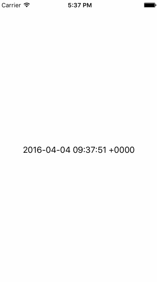

#KVO 使用

网上KVO的文章基本上到处都是，这里自己就总结了下，KVO很强大，基本上KVO就是Objective-C对观察者模式的实现，可以观察某个属性的变化，针对变化通知响应的观察者做出反应。

###**总结从：基本使用->实现是一个时钟->了解观察者模式->了解KVO实现原理->利用runtime自己设计KVO替换掉官方API更加深入的了解它。**

##基本使用

### 简单使用

设计一个Model：

``` bash
//
//  LastDays.h
//  KVO
//
//  Created by LastDays on 16/4/4.
//  Copyright © 2016年 LastDays. All rights reserved.
//

#import <Foundation/Foundation.h>

@interface LastDays : NSObject

@property(nonatomic,strong) NSString *name;

@end

```

设计Observer(观察者)

``` bash
#import "LastdaysObserver.h"

@implementation LastdaysObserver

-(void)observeValueForKeyPath:(NSString *)keyPath
                     ofObject:(id)object
                     change:(NSDictionary<NSString *,id> *)change
                      context:(void *)context{
    NSLog(@"old = %@",[change objectForKey:NSKeyValueChangeOldKey]);
    NSLog(@"old = %@",[change objectForKey:NSKeyValueChangeNewKey]);
    NSLog(@"context:%@",context);

}

@end

```

就是重写

``` bahs

-(void)observeValueForKeyPath:(NSString *)keyPath
                     ofObject:(id)object
                     change:(NSDictionary<NSString *,id> *)change
                      context:(void *)context
```

进入测试

``` bash
//
//  ViewController.m
//  KVO
//
//  Created by LastDays on 16/4/4.
//  Copyright © 2016年 LastDays. All rights reserved.
//

#import "ViewController.h"
#import "LastDays.h"
#import "LastdaysObserver.h"

@interface ViewController ()

@end

@implementation ViewController

- (void)viewDidLoad {
    [super viewDidLoad];
    // Do any additional setup after loading the view, typically from a nib.
    
    [self test];
}

- (void)didReceiveMemoryWarning {
    [super didReceiveMemoryWarning];
    // Dispose of any resources that can be recreated.
}


-(void)test{
    LastdaysObserver *lastdaysObserver = [[LastdaysObserver alloc] init];
    LastDays *lastdays = [[LastDays alloc] init];
    
    lastdays.name = @"ok";
    [lastdays addObserver:lastdaysObserver
               forKeyPath:@"name"
                  options:NSKeyValueObservingOptionNew|NSKeyValueObservingOptionOld
                  context:(void*)self];
    
    lastdays.name = @"name";
    [lastdays removeObserver:lastdaysObserver forKeyPath:@"name"];
}

@end

```


在这里我们使用一下方法添加观察者

``` bash
    [lastdays addObserver:lastdaysObserver
               forKeyPath:@"name"
                  options:NSKeyValueObservingOptionNew|NSKeyValueObservingOptionOld
                  context:(void*)self];
```

查看打印结果:

``` bash
2016-04-04 11:25:04.231 KVO[4046:379396] old = ok
2016-04-04 11:25:04.232 KVO[4046:379396] old = name
2016-04-04 11:25:04.232 KVO[4046:379396] context:<ViewController: 0x7faa0ae34da0>
```


##KVV(键值验证)

可以用来校验数据：

通过一下方法：

``` bash
- (BOOL)validateValue:(inout id *)ioValue forKey:(NSString *)inKey error:(out NSError **)outError;
```

测试:

``` bash
-(void)test{
    LastdaysObserver *lastdaysObserver = [[LastdaysObserver alloc] init];
    LastDays *lastdays = [[LastDays alloc] init];
    
    NSString *name =@"lastdays";
    lastdays.name = name;
    
    //添加观察者
    [lastdays addObserver:lastdaysObserver
               forKeyPath:@"name"
                  options:NSKeyValueObservingOptionNew|NSKeyValueObservingOptionOld
                  context:(void*)self];
    
    
    
    
    if ([lastdays validateValue:&name forKey:@"name" error:nil]) {
        NSLog(@"数据不为空");
    }else{
        NSLog(@"数据为空");
    }
    
    lastdays.name = @"Lastdays";
    
    //移除观察者观察的对应属性
    [lastdays removeObserver:lastdaysObserver forKeyPath:@"name"];
}
```

结果：

``` bash
2016-04-04 12:00:05.157 KVO[4099:398267] 数据不为空
2016-04-04 12:00:05.159 KVO[4099:398267] old = lastdays
2016-04-04 12:00:05.159 KVO[4099:398267] old = Lastdays
2016-04-04 12:00:05.159 KVO[4099:398267] context:<ViewController: 0x7fafa3fa4a60>
```


###简历属性依赖关系:

现在我们只有一个属性，如果添加一个chineseName，将name与chineseName建立关系，chineseName发生变化的时候，同事也能被通知。

``` bash

 //
//  LastDays.m
//  KVO
//
//  Created by LastDays on 16/4/4.
//  Copyright © 2016年 LastDays. All rights reserved.
//

#import "LastDays.h"

@implementation LastDays

+(NSSet *)keyPathsForValuesAffectingName{
    
    NSSet *set = [NSSet setWithObjects:@"chineseName", nil];
    
    return set;
}

@end


```

测试:

``` bash

-(void)test{
    LastdaysObserver *lastdaysObserver = [[LastdaysObserver alloc] init];
    LastDays *lastdays = [[LastDays alloc] init];
    
    NSString *name =@"lastdays";
    lastdays.name = name;
    
    //添加观察者
    [lastdays addObserver:lastdaysObserver
               forKeyPath:@"name"
                  options:NSKeyValueObservingOptionNew|NSKeyValueObservingOptionOld
                  context:(void*)self];
    
    lastdays.name = @"test";
    
    //更改chineseName属性
    lastdays.chineseName = @"小猪";
    
    //移除观察者观察的对应属性
    [lastdays removeObserver:lastdaysObserver forKeyPath:@"name"];
}

```

结果：

``` bash
2016-04-04 12:23:14.649 KVO[4143:408366] old = lastdays
2016-04-04 12:23:14.650 KVO[4143:408366] new = test
2016-04-04 12:23:14.650 KVO[4143:408366] context:<ViewController: 0x7fefa9524030>
2016-04-04 12:23:14.650 KVO[4143:408366] old = test
2016-04-04 12:23:14.650 KVO[4143:408366] new = test
2016-04-04 12:23:14.650 KVO[4143:408366] context:<ViewController: 0x7fefa9524030>

```

到此我们的基本使用就总结完成了。

##实现是一个时钟

建立定时器执行我们的时间更新：

```

//
//  RNTimer.m
//  ClockKVO
//
//  Created by LastDays on 16/4/4.
//  Copyright © 2016年 LastDays. All rights reserved.
//

#import "RNTimer.h"


@interface RNTimer ()
@property (nonatomic, readwrite, copy) void (^block)();
@property (nonatomic, readwrite, strong) dispatch_source_t source;
@end


@implementation RNTimer

@synthesize block = _block;
@synthesize source = _source;

+ (RNTimer *)repeatingTimerWithTimeInterval:(NSTimeInterval)seconds block:(void (^)(void))block
{
    NSParameterAssert(seconds);
    NSParameterAssert(block);
    
    RNTimer *timer = [[self alloc] init];
    timer.block = block;
    timer.source = dispatch_source_create(DISPATCH_SOURCE_TYPE_TIMER, 0, 0,
                                          dispatch_get_main_queue());
    uint64_t nsec = (uint64_t)(seconds * NSEC_PER_SEC);
    dispatch_source_set_timer(timer.source, dispatch_time(DISPATCH_TIME_NOW, nsec),
                              nsec, 0);
    dispatch_source_set_event_handler(timer.source, block);
    dispatch_resume(timer.source);
    return timer;
}

- (void)invalidate
{
    if (self.source) {
        dispatch_source_cancel(self.source);
        self.source = nil;
    }
    self.block = nil;
}

- (void)dealloc
{
    [self invalidate];
}

- (void)fire
{
    self.block();
}

@end

```

这里就不解释了，感兴趣可以看看GCD相关知识.


首先建立一个简易的时钟。

``` bash
#import <Foundation/Foundation.h>

@interface TimeDate : NSObject

@property(nonatomic,copy) NSDate *now;

@end

```

``` bash

//
//  ViewController.m
//  ClockKVO
//
//  Created by LastDays on 16/4/4.
//  Copyright © 2016年 LastDays. All rights reserved.
//

#import "ViewController.h"
#import "TimeDate.h"
#import "RNTimer.h"

@interface ViewController ()
@property (weak, nonatomic) IBOutlet UILabel *showTime;
@property (nonatomic,strong) TimeDate *time;
@property (readwrite, strong) RNTimer *timer;


@end

@implementation ViewController

- (void)viewDidLoad {
    [super viewDidLoad];
    
    if (self.time == nil) {
        self.time = [[TimeDate alloc] init];
    }
    
    id weakSelf = self;
    self.timer = [RNTimer repeatingTimerWithTimeInterval:1
                                      block:^{
                                          [weakSelf updateTime];
                                      }];
    
    [self.time addObserver:self forKeyPath:@"now" options:0 context:(void *)self];
    // Do any additional setup after loading the view, typically from a nib.
}

-(void)observeValueForKeyPath:(NSString *)keyPath ofObject:(id)object change:(NSDictionary<NSString *,id> *)change context:(void *)context{
    self.showTime.text = [self.time.now description];
}


- (void)didReceiveMemoryWarning {
    [super didReceiveMemoryWarning];
    // Dispose of any resources that can be recreated.
}

-(void)updateTime{
    self.time.now = [NSDate new];
    NSLog(@"%@",self.time.now);
}

-(void)dealloc{
    [self.time removeObserver:self forKeyPath:@"now" context:(void *)self];
}

@end

```

效果如下:




接下来进行一下简单封装处理，添加Observer


```
//
//  Observer.h
//  ClockKVO
//
//  Created by LastDays on 16/4/4.
//  Copyright © 2016年 LastDays. All rights reserved.
//

#import <Foundation/Foundation.h>

@interface Observer : NSObject

@property (nonatomic, weak) id observedObject;
@property (nonatomic, copy) NSString* keyPath;
@property (nonatomic, weak) id target;
@property (nonatomic) SEL selector;


/// Create a key-value-observer with the given KVO options
+ (NSObject *)observeObject:(id)object keyPath:(NSString*)keyPath target:(id)target selector:(SEL)selector options:(NSKeyValueObservingOptions)options __attribute__((warn_unused_result));


@end
```

``` bash
//
//  Observer.m
//  ClockKVO
//
//  Created by LastDays on 16/4/4.
//  Copyright © 2016年 LastDays. All rights reserved.
//

#import "Observer.h"

@implementation Observer

- (id)initWithObject:(id)object keyPath:(NSString*)keyPath target:(id)target selector:(SEL)selector options:(NSKeyValueObservingOptions)options;
{
    if (object == nil) {
        return nil;
    }
    NSParameterAssert(target != nil);
    NSParameterAssert([target respondsToSelector:selector]);
    self = [super init];
    if (self) {
        self.target = target;
        self.selector = selector;
        self.observedObject = object;
        self.keyPath = keyPath;
        [object addObserver:self forKeyPath:keyPath options:options context:(__bridge void *)(self)];
    }
    return self;
}


+(NSObject *)observeObject:(id)object keyPath:(NSString *)keyPath target:(id)target selector:(SEL)selector options:(NSKeyValueObservingOptions)options{

    return [[self alloc] initWithObject:object keyPath:keyPath target:target selector:selector options:options];
}


-(void)observeValueForKeyPath:(NSString *)keyPath ofObject:(id)object change:(NSDictionary<NSString *,id> *)change context:(void *)context{
    if (context == (__bridge void *)self) {
        [self didChange:change];
    }
    
}

- (void)didChange:(NSDictionary *)change;
{
    id strongTarget = self.target;
#pragma clang diagnostic push
#pragma clang diagnostic ignored "-Warc-performSelector-leaks"
    [strongTarget performSelector:self.selector withObject:change];
#pragma clang diagnostic pop
}

- (void)dealloc;
{
    [self.observedObject removeObserver:self forKeyPath:self.keyPath];
}

@end

```

然后重写下time属性的set方法

```
//
//  ViewController.m
//  ClockKVO
//
//  Created by LastDays on 16/4/4.
//  Copyright © 2016年 LastDays. All rights reserved.
//

#import "ViewController.h"
#import "TimeDate.h"
#import "RNTimer.h"
#import "Observer.h"

@interface ViewController ()
@property (weak, nonatomic) IBOutlet UILabel *showTime;
@property (nonatomic,strong) TimeDate *time;
@property (readwrite, strong) RNTimer *timer;
@property (nonatomic, strong) id observeToken;


@end

@implementation ViewController

- (void)viewDidLoad {
    [super viewDidLoad];
    
    if (self.time == nil) {
        self.time = [[TimeDate alloc] init];
    }
    
    id weakSelf = self;
    self.timer = [RNTimer repeatingTimerWithTimeInterval:1
                                      block:^{
                                          [weakSelf updateTime];
                                      }];
    // Do any additional setup after loading the view, typically from a nib.
}

-(void)setTime:(TimeDate *)time{
    
    _time = time;
    self.observeToken = [Observer observeObject:self.time keyPath:@"now" target:self selector:@selector(timeDidChange) options:NSKeyValueObservingOptionInitial];
}
- (void)didReceiveMemoryWarning {
    [super didReceiveMemoryWarning];
    // Dispose of any resources that can be recreated.
}

-(void)updateTime{
    self.time.now = [NSDate new];
    NSLog(@"%@",self.time.now);
}

-(void)timeDidChange{
    self.showTime.text = [self.time.now description];
}
@end

```

基本上我们的KVO基本上就实现了，现在来开始设计UI，UI的话这里就不做分享了，毕竟KVO才是关键，只是说一下重点的地方。

``` bash
//初始化视图
-(instancetype)initWithTheme:(DDClockTheme)theme frame:(CGRect)frame{
    
    if (self.time == nil) {
        self.time = [[TimeDate alloc] init];
        self.time.now = [NSDate new];
    }
    id weakSelf = self;
    self.timer = [RNTimer repeatingTimerWithTimeInterval:1
                                                   block:^{
                                                       [weakSelf updateTime];
                                                   }];
    
    //防止用户在构建的时候传入的height和widt不一样 因为时钟是圆的所以强制把他们变成一样
    size = frame.size.height>frame.size.width?frame.size.height:frame.size.width;
    CGRect realRect = CGRectMake(frame.origin.x, frame.origin.y, size, size);
    self = [self initWithFrame:realRect];
    if (self) {
        _theme = theme;
        _scale = realRect.size.height / DDClockSize;
        _centerPoint = CGPointMake(size/2, size/2);
        
        /**
         *  这里可以自定义主题
         */
        switch (theme) {
            case DDClockThemeDark:
                rimColor = [UIColor colorWithRed: 66.0/255 green: 66.0/255 blue: 66.0/255 alpha: 1];
                faceColor = [UIColor colorWithRed: 66.0/255 green: 66.0/255 blue: 66.0/255 alpha: 1];
                markColor = [UIColor colorWithRed:  1 green: 1 blue: 1 alpha: 1];
                secondHandColor = [UIColor colorWithRed: 32.0/255.0 green: 250.0/255.0 blue: 200.0/255.0 alpha: 1];
                fontColor = [UIColor colorWithRed: 1 green: 1 blue: 1 alpha: 1];
                hourAndMinuteHandColor = [UIColor colorWithRed: 1 green: 1 blue: 1 alpha: 1];
                break;
                
            default:
                break;
        }
    }
    self.backgroundColor = [UIColor clearColor];
    return self;
}
```
``` bash
/** 
 *  更新数据
 */
-(void)updateTime{
    self.time.now = [NSDate new];
    NSLog(@"%@",self.time.now);
}
```

初始化视图，建立定时器，不停的更新当前时间。基本上跟上面讲述的一样

然后重写setter方法，初始化time属性的时候，添加观察者，让View观察time.now的属性变化，变化就对象做出反应，更新视图，然后重写-(void)drawRect:(CGRect)rect方法。这样View就会通过KVO机制与Model数据保持一致性。

``` bash
/**
 *  重写time setter方法
 *
 *  @param time time
 */
-(void)setTime:(TimeDate *)time{
    
    _time = time;
    self.observeToken = [Observer observeObject:self.time keyPath:@"now" target:self selector:@selector(updateView) options:NSKeyValueObservingOptionInitial];
}

```

``` bash
/**
 *  刷新视图
 */
-(void)updateView{
    dispatch_async(dispatch_get_main_queue(), ^{
        [self setNeedsDisplay];//这个方法调用后就会刷新这个View
    });
}
```

其实实现方案基本上是一样的。 

看一下效果：

  


## 观察者模式

上面总结了KVO的使用，并且做了一个小东西，上面介绍过，KVO 是 Objective-C 对观察者模式（Observer Pattern）的实现。也是 Cocoa Binding 的基础。当被观察对象的某个属性发生更改时，观察者对象会获得通知。那么什么是观察者模式呢？简单的来了解下吧

###定义

观察者模式(Observer Pattern)：定义对象间的一种一对多依赖关系，使得每当一个对象状态发生改变时，其相关依赖对象皆得到通知并被自动更新。观察者模式又叫做发布-订阅（Publish/Subscribe）模式、模型-视图（Model/View）模式、源-监听器（Source/Listener）模式或从属者（Dependents）模式。

### 分析

观察者模式就是让各个对象之间建立一个依赖关系，当有一个发生变化的时候，其他对象做出响应，就是说每个观察者都将即时更新自己的状态，以与目标状态同步，这种交互也称为发布-订阅(publishsubscribe)，发布就相当于我们的通知中心，订阅也就相当于我们的观察者，简单的说名就是，我们去一个订阅中心订阅了一个书刊，然后告诉订阅中心，然后告诉订阅中心我订阅的这个书刊要是有更新的时候，告诉我一声。我们的KVO也就是这个原理。

### 优点分析

* 分离表示层与数据逻辑层，定义一种稳定的消息更新传递机制，可以实现让我们的程序中不同角色的对象都可以作为一个观察者。
* 观察者模式还具备广播能力（在钟表的项目中，我们的lable和自定义的View都接收到通知中心的通知，并且都会做出相应的反应）
* 观察者模式在观察目标和观察者之间建立一个抽象的耦合关系

### 确定

* 如果一个观察目标对象有很多直接和间接的观察者的话，将所有的观察者都通知到会花费很多时间。(在钟表项目中，观察Time的对象仅仅有两个，如果由上百个，很浪费时间)
* 还有一种情况我们需要注意，就是循环观察，这样可能会进入一种苏循环中，很可能造成程序的崩溃，这种也很难找到原因。
* 观察者模式没有相应的机制让观察者知道所观察的目标对象是怎么发生变化的，而仅仅只是知道观察目标发生了变化。（但是KVO应该在这方面做了支持）

### 总结

观察者模式定义对象间的一种一对多依赖关系，使得每当一个对象状态发生改变时，其相关依赖对象皆得到通知并被自动更新。观察者模式又叫做发布-订阅模式、模型-视图模式、源-监听器模式或从属者模式。观察者模式是一种对象行为型模式。

观察者模式定义了一种一对多的依赖关系，让多个观察者对象同时监听某一个目标对象，当这个目标对象的状态发生变化时，会通知所有观察者对象，使它们能够自动更新。

在我们的工程中，也有一个简单的观察者模式的示例。


## KVO的实现原理

### 简介

KVO确实有点黑魔法，我原来在使用的时候就考虑过它是怎么实现的？但是那个时候对runtime的理解并不太多，实际上KVO的实现就是基于runtime这种实时运行系统。

苹果官方对KVO的实现确实做过简单的解释

>Automatic key-value observing is implemented using a technique called isa-swizzling... When an observer is registered for an attribute of an object the isa pointer of the observed object is modified, pointing to an intermediate class rather than at the true class ...

这么强大的黑魔法，就说了这么点，但是其中有一个很关键的一句话就是，被观察的对象的isa指针会指向一个中间类，而不是原来的类。

在这里看出来差不多就是应用了runtime。自己google了一下，发现了很多资料简单的先来阐述一下KVO的实现，同样看到这里的时候，多少应该对runtime有个了解才行，否则很难明白这些东西。

感兴趣可以看一下我之前总结的一篇文章[Runtime学习笔记](http://lastdays.cn/2016/02/22/runtime/)

还是根据我们上面的项目进行分析，当我们观察**time.now**属性的时候，系统使用runtime动态创建一个新的类，这个类会继承TimeDate类。并且重写now属性的setter方法。这里被重写的方法其实就是用来通知观察者的。这个时候，我们的isa（isa 指针告诉 runtime 系统这个对象的类是什么 ）指针会指向我们新创建的子类，因此，我们的实例对象就变成了一个新的类的实例。其实这个中间类，也就是我们动态创建出来的。

基本的实现原理就是这样，这里很多人可能也会发觉，其实KVO并不是没有缺点，在我们上面时钟的的练习中，我们就发现了，我们想自定义selector但是没办法，后来是也在接口里加上了target，selector参数，才实现了一些功能，而且我们常用的block也是不支持的。这也是很多人的吐槽点。

### 简单的实现


根据上面说的，我们需要动态创建一个中间类，继承自被观察实例的类,重写setter方法，将isa指针指向新的类，这里就是使用runtime来帮我们实现。具体的实现说明我在代码中标注了，简单的思路就是获取当前类，super_class指向我们的当前类，然后使用objc_allocateClassPair时候一些基本信息就会被添加到子类中。

动态创建新的类。

``` bash
//
//  NSObject+KVO.m
//  MakeKVO
//
//  Created by LastDays on 16/4/5.
//  Copyright © 2016年 LastDays. All rights reserved.
//

#import "NSObject+KVO.h"
#import <objc/runtime.h>


NSString *const LYKVOPrefix = @"LYNewClass_";

@implementation NSObject(LYKVO)

-(void)LY_addObserver:(NSObject *)observer forKey:(NSString *)key{
    
    
    Class class = object_getClass(self);
    NSString *className = NSStringFromClass(class);
    
    //定义中间类类
    Class childrenClass =  [self makeChildrenClassWithName:className];
    
    //改变isa指针，指向中间类
    object_setClass(self, childrenClass);
}
-(void)LY_removeObserver:(NSObject *)observer forKey:(NSString *)key{
    
}

-(Class)makeChildrenClassWithName:(NSString *)superName{
    
    /**
     *  建立新的类名：我们以LYNewClass_+superName
     */
    NSString *childrenName = [LYKVOPrefix stringByAppendingString:superName];
    

    
    /**
     *  获取父类
     *
     *  @param self 当前类
     *
     *  @return 返回当前类（也就是中间类的父类）
     */
    Class superClass = object_getClass(self);
    
    /**
     *  动态创建中间类
     *
     *  @param superClass              父类（self）,如果建立根类，可以选择填写nil
     *  @param childrenName.UTF8String 类名
     *  @param 0                       该参数是分配给类和元类对象尾部的索引ivars的字节数。
     *
     *  @return 中间类
     */
    Class childrenClass = objc_allocateClassPair(superClass, childrenName.UTF8String, 0);
    
    /**
     *  获取父类类方法（这里说的父类就是当前类）
     *
     *  @param superClass self
     *  @param class      class
     *
     *  @return  superMethod
     */
    Method superMethod = class_getClassMethod(superClass, @selector(class));
    
    //参数types是一个描述传递给方法的参数类型的字符数组，这就涉及到类型编码
    const char *types = method_getTypeEncoding(superMethod);
    
    //获取函数具体地址
    IMP imp = class_getMethodImplementation(superClass, @selector(class));
    
    /**
     *  向childrenClass添加方法
     *
     *  @param childrenClass 中间类
     *  @param class         class
     *
     *  @return BOOL
     */
    class_addMethod(childrenClass, @selector(class), imp, types);
    
    /**
     *  注册，之后这个新类就可以在程序中使用了
     */
    objc_registerClassPair(childrenClass);
    
    
    
    
    return childrenClass;
    
}

@end

```

看一下

然后就是重写setter，我们上面提到过的方案就是重写setter方法，在setter中实现我们的通知，数据一旦变化就可以通知观察者。重写setter我们使用**class_addMethod**，它的实现会覆盖父类的方法实现，但不会取代本类中已存在的实现，如果本类中包含一个同名的实现，则函数会返回NO。

这里我们的**lykvo_setter**就是我们重写的方法。

``` bash
    //获取父类的setter
    NSString *superSetterName = [NSString stringWithFormat:@"set%@%@:", [key substringToIndex:1].uppercaseString,[key substringFromIndex:1]];
    SEL setterSelector = NSSelectorFromString(superSetterName);
    Method superSetterMethod = class_getInstanceMethod(superClass, setterSelector);
    
    if (![self isExistence:setterSelector]) {
        //重写setter,改变IMP
        const char *types = method_getTypeEncoding(superSetterMethod);
        class_addMethod(childrenClass, setterSelector,(IMP)lykvo_setter, types);
    }

```
lykvo_setter

```
#pragma mark - Overridden Methods
void lykvo_setter(id self,SEL _cmd,id value){
    
    
    NSString *setterName = NSStringFromSelector(_cmd);
    NSString *getterName = [self getGetterForKeyWithSetterName:setterName];
    
    SEL getter = NSSelectorFromString(getterName);
    
    
    NSLog(@"getterName = %@",getterName);
    id oldValue = ((id (*)(id, SEL))(void *) objc_msgSend)((id)self,getter);
    
    NSLog(@"oldValue = %@",oldValue);
    /**
     *  向父类发送消息，但是接收消息的仍然是我们的self
     */
    
    //((void (*)(id, SEL, id))(void *) objc_msgSend)((id)self, _cmd, value);
    struct objc_super superClass = {
            .receiver = self,
            .super_class = class_getSuperclass(object_getClass(self))
        };
    ((void (*)(id, SEL, id))(void *) objc_msgSendSuper)((__bridge id)(&superClass), _cmd, value);
    
    
    
}

```

这里我们就详解下，一个Objective-C方法是一个简单的C函数，它至少包含两个参数—self和_cmd。所以，我们的实现函数(IMP参数指向的函数)至少需要两个参数：

``` bash
void myMethodIMP(id self, SEL _cmd)

{

    // implementation ....

}

```

这里用到的另一种就是，我们通过**objc_msgSend**，来模拟getter方法来获取oldValue，那么Value该怎么处理？这个新的值我们又该怎么传递进去呢?我们也是使用模拟setter的方案，但是现在来想一下，我们现在已经重写了setter方法，那样肯定就照成循环引用，就是不停的卡死在我们的lykvo_setter，这个时候我就想到了superClass，这个方法里面的setter是是没有变化的，而且通过查询资料也发现，首先我们需要知道的是super与self不同。self是类的一个隐藏参数，每个方法的实现的第一个参数即为self。而super并不是隐藏参数，它实际上只是一个”编译器标示符”，它负责告诉编译器，当调用setter方法时，去调用父类的方法，而不是本类中的方法。而它实际上与self指向的是相同的消息接收者。

可以来看一下测试：

``` bash
- (void)viewDidLoad {
    [super viewDidLoad];
    // Do any additional setup after loading the view, typically from a nib.
    
    
//    Model *model = [[Model alloc] init];
//    [model LY_addObserver:nil forKey:@"name"];
//    model.name = @"ok";
//    
//    [model test];
    
    
    NSLog(@"super = %@",super.class);
    NSLog(@"super = %@",self.class);
}

```

看一下结果：

``` bash
2016-04-07 18:25:25.989 MakeKVO[21992:1461041] super = ViewController
2016-04-07 18:25:25.990 MakeKVO[21992:1461041] super = ViewController
```

可以看到，我们的接收者都是self。


这样我们就可以提出一个解决方案，让新的**setter**去调用**superClass**的**setter**进行赋值，在做接下来的处理。这里需要强调的是想**superClass**发送消息需要使用**objc_msgSendSuper**。

写到这里，基本上我们的项目已经到了最后一步了，就是添加观察者。我们就在接口中传入一个block吧。相关的，我们在这里先来介绍下**Associated Objects**，在一个常见的应用场景中就是为 KVO 创建一个关联的观察者。

与 Associated Objects 相关的函数主要有三个，我们可以在 runtime 源码的 runtime.h 文件中找到它们的声明：

``` bash
void objc_setAssociatedObject(id object, const void *key, id value, objc_AssociationPolicy policy);
id objc_getAssociatedObject(id object, const void *key);
void objc_removeAssociatedObjects(id object);

```

* objc_setAssociatedObject 用于给对象添加关联对象，传入 nil 则可以移除已有的关联对象；
* objc_getAssociatedObject 用于获取关联对象；
* objc_removeAssociatedObjects 用于移除一个对象的所有关联对象。

``` bash
    //添加关联，添加观察者
    ObserverInfo *info = [[ObserverInfo alloc] initWithObserver:observer Key:key lyBlock:lyblock];
    NSMutableArray *observers = objc_getAssociatedObject(self, (__bridge const void *)LYObserverInfo);
    if (!observers) {
        observers = [[NSMutableArray alloc] init];
        objc_setAssociatedObject(self, (__bridge const void *)LYObserverInfo, observers, OBJC_ASSOCIATION_RETAIN_NONATOMIC);
    }
    
    [observers addObject:info];

```


通知

``` bash

    /**
     *  这里就是进行通知了。
     */
    NSMutableArray *observers = objc_getAssociatedObject(self, (__bridge const void *)LYObserverInfo);
    for (ObserverInfo *observer in observers) {
        if ([observer.key isEqual:getterName]) {
            dispatch_async(dispatch_get_global_queue(DISPATCH_QUEUE_PRIORITY_DEFAULT, 0), ^{
                observer.lyBlock(self, getterName, oldValue, value);
            });
        }
    }
    
```

## 总结

我们的总结


>当一个object有观察者时，动态创建这个object的类的子类
对于每个被观察的property，重写其set方法
在重写的set方法中调用,通知观察者
当一个property没有观察者时，删除重写的方法
当没有observer观察任何一个property时，删除动态创建的子类

**基本使用->实现是一个时钟->了解观察者模式->了解KVO实现原理->利用runtime自己设计KVO替换掉官方API更加深入的了解它**

基本上就是对runtime有了一个更深的认识，还有就是一些基本的使用，动态创建类，改变isa指针，重写方法都有了一些认知

在这里就基本完成了，现在对KVO有了一个更深的了解，在这里提供一个些我学习过程中用到的资料

* [Objective-C Runtime 运行时之一：类与对象](http://southpeak.github.io/blog/2014/10/25/objective-c-runtime-yun-xing-shi-zhi-lei-yu-dui-xiang/)
* [Objective-C Runtime 运行时之六：拾遗](http://southpeak.github.io/blog/2014/11/09/objective-c-runtime-yun-xing-shi-zhi-liu-:shi-yi/)
* [Associated Objects](http://nshipster.cn/associated-objects/)
* [objc kvo简单探索](http://blog.sunnyxx.com/2014/03/09/objc_kvo_secret/)


